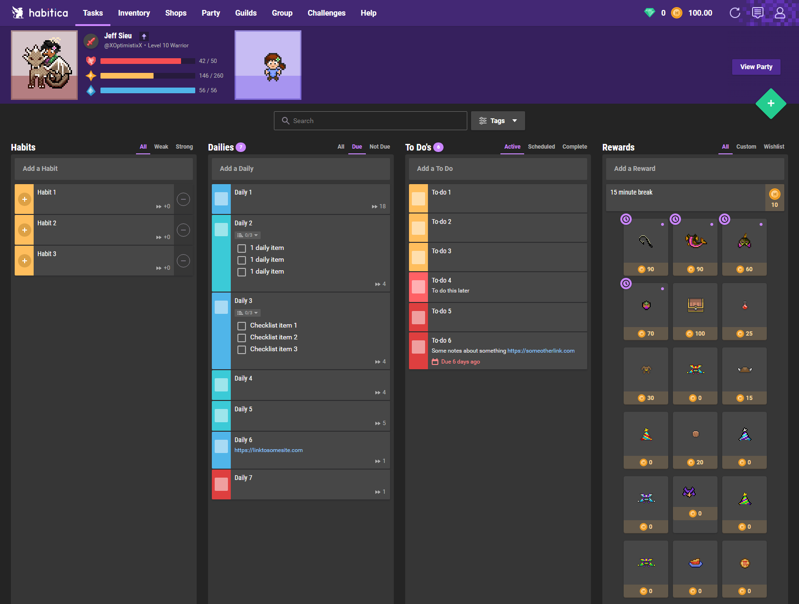
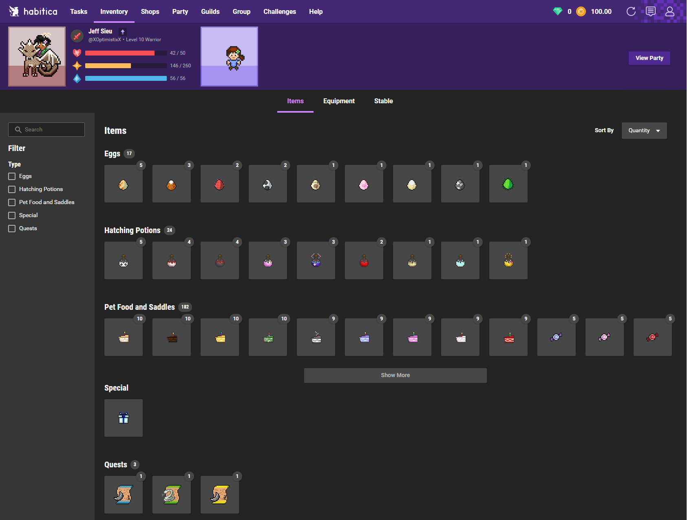
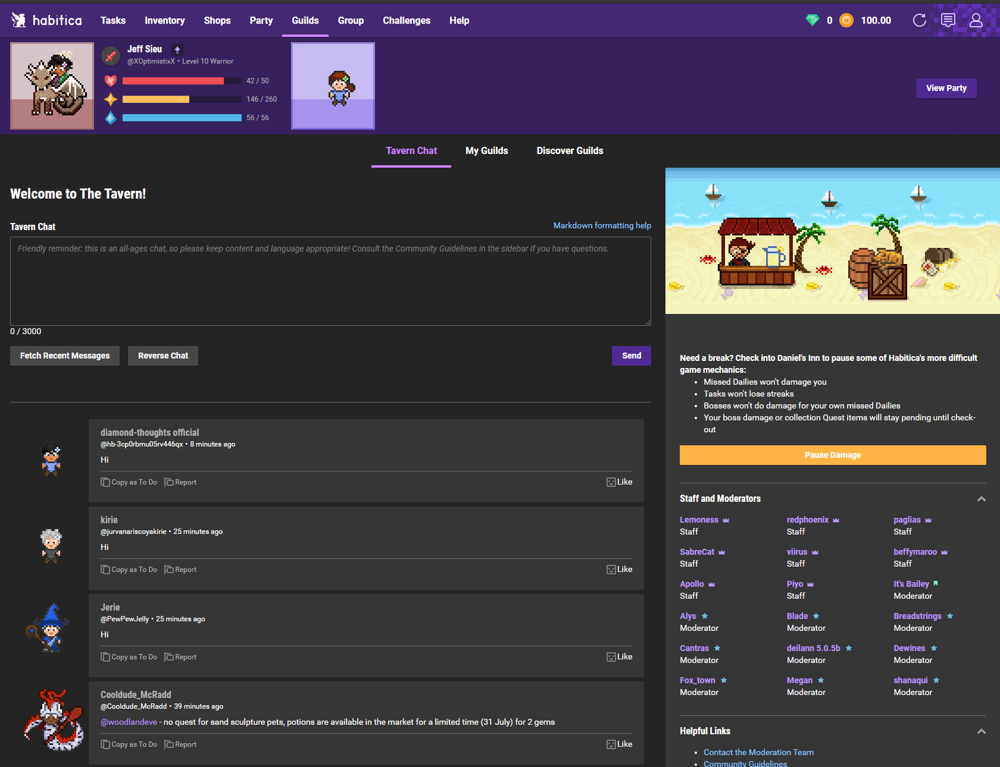

# Habitica Dark

## Install

Install Stylus:

- [Stylus for Chrome](https://chrome.google.com/webstore/detail/stylus/clngdbkpkpeebahjckkjfobafhncgmne/)
- [Stylus for Firefox](https://addons.mozilla.org/en-GB/firefox/addon/styl-us/)

Then:

## More screenshots

